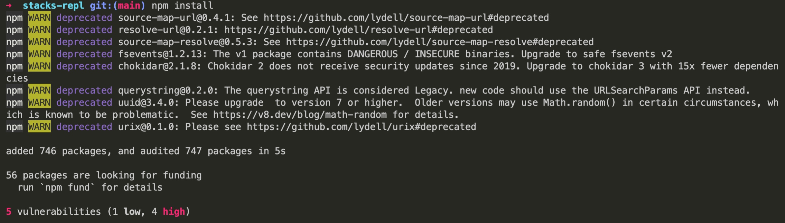

## Introduction

The Stacks REPL project enables users to try out Stacks API without the installation overhead. 
It allows users to change and run API from a browser. It is fast with a low learning curve.  

Follow the instructions below to install the application and interact with the code.

## Installation

In your terminal, clone the [Stacks-repl](https://github.com/hirosystems/stacks-repl/tree/main) repository by using the following command.

`git clone git@github.com:hirosystems/stacks-repl.git`

Navigate to the cloned directory by using the following command.

`cd stacks-repl`

Now, run the command below to install npm.

`npm install`

You can start the application by using the following command.

`npm start`

## REPL Usage

After starting the application in a browser, users can use the live editor to interact with the Stacks API. Navigate to the landing page where there is a live editor with an example method, `getPoxOperationInfo().`

Stacks REPL helps you generate runtime responses connecting to the stacks network. The sample interactive code and its response look like this:

## Supported Customizations 

### Networks

- mainnet
- testnet

### Methods

:::note

You can follow the links for each method to understand its usage.

:::

- [getCycleDuration()](https://docs.hiro.so/stacks.js/how-to-guides/how-to-integrate-stacking#step-3-display-stacking-info)
- [isStackingEnabledNextCycle()](https://docs.hiro.so/stacks.js/how-to-guides/how-to-integrate-stacking#step-3-display-stacking-info)
- [getSecondsUntilNextCycle()](https://docs.hiro.so/stacks.js/how-to-guides/how-to-integrate-stacking#step-3-display-stacking-info)
- [getPoxInfo()](https://docs.hiro.so/stacks.js/how-to-guides/how-to-integrate-stacking#step-3-display-stacking-info)
- [getCoreInfo()](https://docs.hiro.so/stacks.js/how-to-guides/how-to-integrate-stacking#step-3-display-stacking-info)
- [getTargetBlockTime()](https://docs.hiro.so/stacks.js/how-to-guides/how-to-integrate-stacking#step-3-display-stacking-info)
- [getStatus()](https://docs.hiro.so/stacks.js/how-to-guides/how-to-integrate-stacking#step-3-display-stacking-info)
- [canStack()](https://docs.hiro.so/stacks.js/how-to-guides/how-to-integrate-stacking#step-4-verify-stacking-eligibility)

## Example Walkthrough

Follow this video to understand an example.
// Link to be added after Max's recording.
